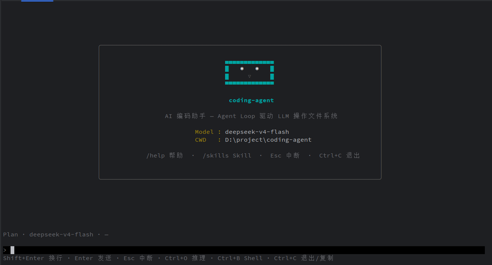
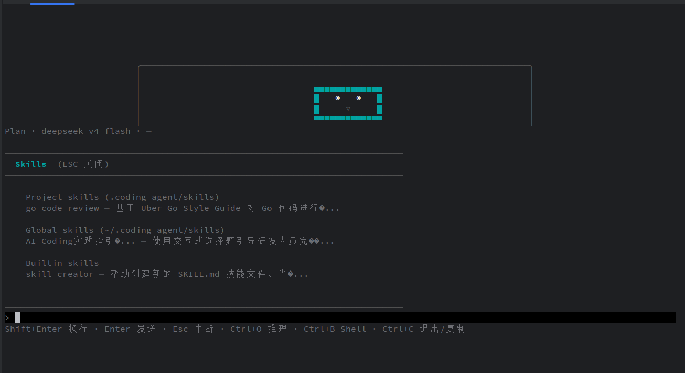
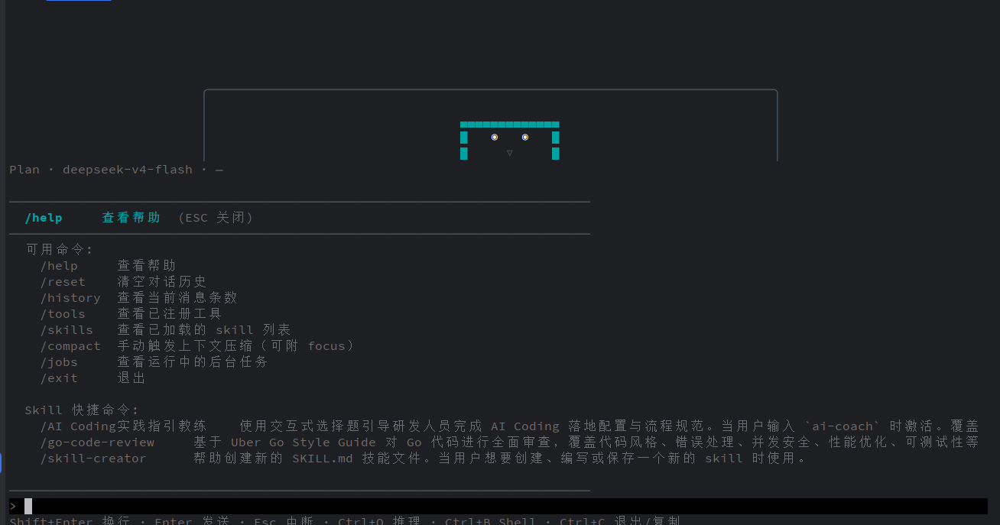
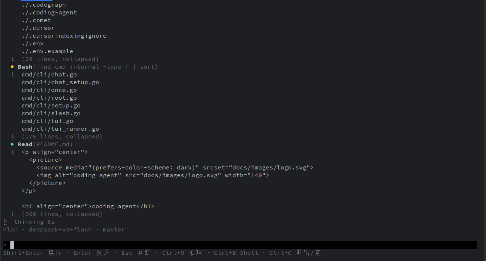

<p align="center">
  <picture>
    <source media="(prefers-color-scheme: dark)" srcset="docs/images/logo.svg">
    
  </picture>
</p>

<h1 align="center">coding-agent</h1>

<p align="center">
  <strong>终端 AI 编码助手 — REPL / TUI 双界面，LSP 代码智能 · MCP 外部工具 · Git Worktree 隔离</strong>
</p>

<p align="center">
  <a href="#安装"></a>
  <a href="./LICENSE"></a>
</p>

---

## 安装

```bash
go install github.com/wsx864321/coding-agent/cmd@latest
```

或从源码构建：

```bash
git clone https://github.com/wsx864321/coding-agent.git
cd coding-agent
go build -o coding-agent ./cmd
```

### 环境变量

```bash
# OpenAI 兼容
export OPENAI_API_KEY=sk-xxx

# DeepSeek 等兼容 API
export OPEN_BASE_URL=https://api.deepseek.com/v1

# Anthropic
export PROVIDER_KIND=anthropic
export ANTHROPIC_API_KEY=sk-ant-xxx
```

支持 `.env` 文件自动加载（`--env` 指定路径，`--env -` 禁用）。

---

## 快速开始

```bash
# 一次性对话
coding-agent once -m "总结项目架构"

# 交互式 REPL（支持 / 命令）
coding-agent chat

# 全屏 TUI 界面
coding-agent tui

# 会话恢复
coding-agent chat --list
coding-agent chat --resume latest
```

---

## 可用工具

| 工具 | 说明 |
|------|------|
| `read_file` / `write_file` / `edit_file` | 文件读写编辑 |
| `glob_file` | Glob 模式文件发现 |
| `web_fetch` | HTTP/HTTPS 抓取（HTML 转纯文本） |
| `bash` | Shell 命令执行（支持后台） |
| `worktree` | Git worktree 管理（create / list / remove） |
| `lsp_definition` | 跳转到符号定义 |
| `lsp_references` | 查找所有引用 |
| `lsp_hover` | 类型签名和文档 |
| `lsp_diagnostics` | 编译 / 静态分析诊断 |
| `code_index` | 符号索引（outline + search） |
| `todo_write` / `complete_step` | 任务跟踪 |
| `task` | 派生子代理 |
| `remember` / `forget` / `recall` | 长期记忆 |
| `run_skill` / `install_skill` | Skill 管理 |
| `install_source` | MCP server 安装 / 卸载 |

---

## 核心特性

### LSP 代码智能

通过 LSP 协议提供跳转定义、查找引用、类型提示、编译诊断、符号索引。支持 Go / TypeScript / Python / Rust，自动检测项目语言。[详细设计 →](docs/lsp-design.md)

### MCP 外部工具

通过 MCP 协议接入外部工具服务（stdio / HTTP），运行时动态安装卸载。[详细设计 →](docs/mcp-design.md)

### Git Worktree 隔离

启动时自动检测 worktree 状态，提供 `worktree` 工具管理隔离工作空间。[详细设计 →](docs/worktree-design.md)

### Skill 系统

Markdown 驱动的可复用技能，支持 inline 和 subagent 两种模式，三级发现。[详细设计 →](docs/skill-system.md)

### 子代理 & 后台任务

`task` 派生子代理，`bash` 和 `task` 均支持后台执行。[详细设计 →](docs/subagent.md) [详细设计 →](docs/background-jobs.md)

### 上下文压缩 & 长期记忆

三层递进压缩策略，BM25 检索记忆系统。[详细设计 →](docs/compaction-design.md) [详细设计 →](docs/memory-design.md)

### Hook 系统

外部 shell 命令扩展，四个事件：`UserPromptSubmit`、`PreToolUse`、`PostToolUse`、`Stop`。[详细设计 →](docs/hook-system-design.md)

### 权限管控

串行 Checker 管线（deny-list / bash-ask / workdir-boundary），按模式分级。

### 多 Provider

OpenAI / Anthropic 双 Provider，通过 `-P` 切换。

---

## 架构

```
cmd/cli/          ← Cobra CLI（root / chat / once / tui）
internal/
  agent/          ← Agent 循环、压缩、子代理、System Prompt
  provider/       ← LLM Provider（OpenAI / Anthropic）
  tools/          ← 工具接口 + 全部工具实现
  lsp/            ← LSP 客户端（多语言）
  mcp/            ← MCP 客户端
  jsonrpc/        ← JSON-RPC 2.0 传输层（LSP/MCP 共享）
  permission/     ← Allow/Deny 管线
  hooks/          ← Shell Hook 引擎
  skill/          ← Skill 发现 / 解析
  memory/         ← 长期记忆（BM25）
  jobs/           ← 后台任务管理
  tui/            ← Bubble Tea 全屏界面
docs/             ← 设计文档
```

---

## 截图

<p align="center">
  
  
</p>
<p align="center">
  
  
</p>

---

## 许可证

MIT
