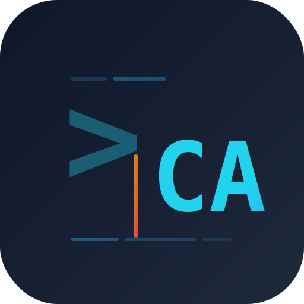

<p align="center">
  <picture>
    <source media="(prefers-color-scheme: dark)" srcset="logo.svg">
    
  </picture>
</p>

<h1 align="center">coding-agent</h1>

<p align="center">
  <strong>用命令行驱动 AI 编码助手 — 连接任意 OpenAI 兼容 API，让 LLM 操作你的文件系统</strong>
</p>

<p align="center">
  <a href="#安装"></a>
  <a href="./LICENSE"></a>
</p>

---

## 简介

**coding-agent** 是一个 Go 编写的 CLI 编码助手。它通过 OpenAI 兼容协议连接 LLM（OpenAI、DeepSeek 等），在 Agent Loop 中驱动模型使用工具完成编码任务：

- 读取、写入、编辑文件
- 执行 shell 命令
- 搜索代码库
- 派生子代理处理子任务
- 长期记忆的存取
- 结构化任务跟踪（SDD 流程）

当上下文趋近窗口上限时，自动触发三级压缩策略（裁剪 → 摘要 → 容错），并采用 **threshold-gated** 设计保护 Prompt Cache 命中率。

---

## 安装

```bash
go install github.com/wsx864321/coding-agent/cmd@latest
```

或从源码构建：

```bash
git clone https://github.com/wsx864321/coding-agent.git
cd coding-agent
go build -o coding-agent ./cmd
```

### 环境变量

至少需要设置 API Key：

```bash
export OPENAI_API_KEY=sk-xxx
```

如果使用非 OpenAI 兼容服务（如 DeepSeek），还需设置 Base URL：

```bash
export OPEN_BASE_URL=https://api.deepseek.com/v1
```

---

## 快速开始

### One-Shot 模式

```bash
coding-agent once -m "阅读 main.go 并总结核心逻辑"
```

一次性执行任务，输出结果后退出。

### 交互式 REPL

```bash
coding-agent chat
```

进入多轮对话，支持 slash 命令：

| 命令 | 说明 |
|------|------|
| `/help` | 帮助 |
| `/reset` | 清空对话历史 |
| `/compact [focus]` | 手动压缩上下文 |
| `/tools` | 列出所有工具 |
| `/hooks` | 查看 hook 统计 |
| `/skills` | 列出已加载 Skill |
| `/<skill_name>` | 触发指定 Skill |
| `/history` | 查看消息数量 |
| `/exit` | 退出 |

### 会话恢复

```bash
coding-agent chat --list              # 列出当前项目所有会话
coding-agent chat --resume latest     # 恢复最近会话
coding-agent chat --resume abc123     # 按 ID 前缀恢复
```

---

## 可用工具

| 工具 | 说明 |
|------|------|
| `bash` | 执行 shell 命令（跨平台） |
| `read_file` | 读取文件，支持行范围 |
| `write_file` | 写入/覆盖文件，自动创建目录 |
| `edit_file` | 精确查找替换 |
| `glob_file` | Glob 模式文件发现 |
| `todo_write` | 结构化任务列表管理 |
| `complete_step` | 签署完成步骤（附验证证据） |
| `task` | 派生子代理执行隔离子任务 |
| `compact` | 模型主动请求上下文压缩 |
| `remember` | 保存事实到长期记忆 |
| `forget` | 删除记忆 |
| `recall` | 搜索/读取/列出记忆 |
| `run_skill` | 触发已加载的 Skill |
| `install_skill` | 安装新 Skill |

---

## 配置参数

### CLI 参数

| 参数 | 默认值 | 说明 |
|------|--------|------|
| `-M, --model` | `gpt-4o-mini` | 模型名称 |
| `-u, --base-url` | env `OPEN_BASE_URL` | OpenAI 兼容 API 地址 |
| `-t, --max-turns` | `100` | Agent 循环最大轮数 |
| `-s, --system` | 自动生成 | 自定义 System Prompt |
| `-w, --workdir` | 当前目录 | 文件操作允许的根目录 |
| `--context-window` | `0`（关闭） | 上下文窗口 token 数，>0 开启自动压缩 |
| `--soft-compact-ratio` | `0.50` | 软阈值，仅提示不压缩 |
| `--compact-ratio` | `0.80` | 摘要压缩触发阈值 |
| `--compact-force-ratio` | `0.90` | 强制压缩阈值，跳过经济判断 |
| `--recent-keep` | `3` | 压缩时保留的最近消息下限 |
| `--max-messages-snip` | `80` | 消息裁剪上限，<=0 关闭 |
| `--archive-dir` | `~/.coding-agent/archives` | 压缩归档根目录 |

### 环境变量

除 `OPENAI_API_KEY` 外，所有配置都支持通过环境变量设置，前缀为 `CODING_AGENT_`：

```bash
CODING_AGENT_MODEL=deepseek-chat
CODING_AGENT_MAX_TURNS=200
CODING_AGENT_CONTEXT_WINDOW=128000
CODING_AGENT_COMPACT_RATIO=0.80
CODING_AGENT_TEMPERATURE=0.7
```

---

## 核心特性

### 1. 上下文压缩（Threshold-Gated）

采用三层递进策略，**不会每轮都触碰消息历史**，仅在 PromptTokens ≥ 窗口 80% 时才触发压缩，维持 append-only 的高 Cache 命中率：

- **M1 低成本裁剪**：裁剪过期工具输出 + 消息数超限裁剪（不调用 LLM）
- **M2 摘要压缩**：调用 LLM 将中间历史折叠为结构化摘要
- **M3 容错机制**：防循环保护 + 摘要失败机械兜底

[详细设计文档 →](docs/compaction-design.md)

### 2. 子代理 / 任务委托

`task` 工具可派生子代理处理隔离子任务。子代理拥有独立的对话上下文和证据账本，共享文件系统和 LLM 客户端，支持配置模型和最大步数。禁止嵌套。

[详细设计文档 →](docs/subagent-design.md)

### 3. 长期记忆

双层记忆系统：层级化的 `AGENTS.md` 文档 + 持久化记忆存储（BM25 检索）。支持四种类型：`user`（用户偏好）、`feedback`（工作反馈）、`project`（项目目标）、`reference`（外部引用）。

[详细设计文档 →](docs/memory-design.md)

### 4. Skill 系统

Markdown 驱动的可复用技能系统。支持两种执行模式：`inline`（内容融入当前对话）和 `subagent`（隔离执行）。三级发现机制：项目级 → 全局级 → 内置。兼容 `.claude/skills/` 和 `.agents/skills/` 目录。

[详细设计文档 →](docs/skill-design.md)

### 5. Hook 系统

四个生命周期事件：
- `UserPromptSubmit` — 用户提交时（通知型）
- `PreToolUse` — 工具执行前（可阻断）
- `PostToolUse` — 工具执行后（副作用型）
- `Stop` — 模型输出最终答案时（可强制续跑）

[详细设计文档 →](docs/hooks-design.md)

### 6. 权限管控

串行 Checker 管线：首个 Deny 即短路执行。内置三个 Checker：
- `deny-list` — 命令/关键词黑名单
- `bash-ask` — 交互式审批
- `workdir-boundary` — 文件系统沙箱

`once` 模式下默认拒绝；`chat` 模式下交互式询问。

### 7. 会话持久化

自动保存/加载到 `~/.coding-agent/sessions/<project-bucket>/`，JSONL 格式。支持按 `latest` 或 ID 前缀恢复。原子写入（temp+rename）。

---

## 架构

```
cmd/
  cli/           ← cobra CLI (root / chat / once)
internal/
  agent/         ← Agent 循环、配置、压缩、子代理、System Prompt
  tools/         ← 工具接口 + 全部工具实现
  permission/    ← Allow/Deny 管线 + Asker 接口
  hooks/         ← 事件 Hook 注册与触发
  memory/        ← 长期记忆（Store、Queue、Docs、BM25）
  retrieval/     ← 纯 Go BM25 搜索引擎
  skill/         ← Skill 发现、解析、目录
  evidence/      ← todo_write/complete_step 证据账本
docs/            ← 设计文档
e2e/             ← 端到端测试
```

---

## 许可证

MIT
